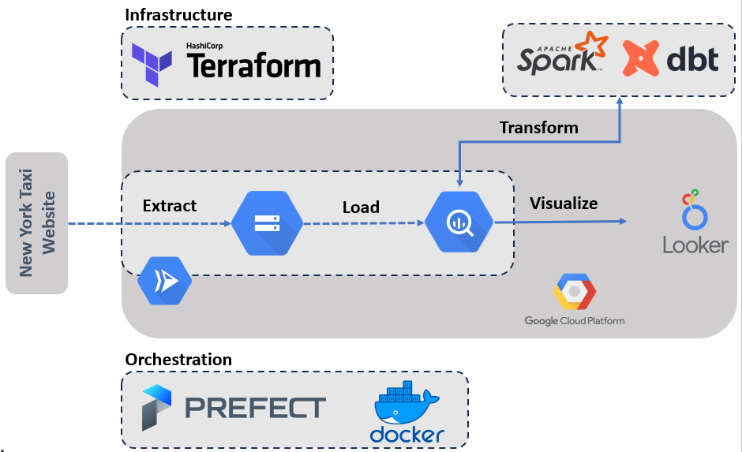

# Big Data Project - NYC Taxi Data Analysis


## 1. Giới thiệu về project

-	Là một trong những thành phố nhộn nhịp nhất và nằm ở trái tim của nước Mỹ, thành phố New York hàng tháng chứng kiến hàng triệu chuyến đi taxi, tạo ra một lượng dữ liệu khổng lồ lên đến 143.6 terabytes với hơn 1.36 tỉ bản ghi. Đây không chỉ đơn giản là dữ liệu thô mà là một mỏ vàng ẩn chứa nhiều câu chuyện chờ được khám phá.
-	Mục tiêu của project này là xây dựng 1 data pipeline tự động thu thập, biến đổi và biểu diễn lượng dữ liệu trên nhằm phục vụ cho các bài toán phân tích sau này. Prefect được sử dụng để xây dựng pipeline download data từ web về và upload lên Google Cloud Storage (GCS) và Google BigQuery. Trong BigQuery, dữ liệu được làm sạch, biến đổi và kiểm tra sử dụng dbt và Spark nhằm tạo ra bộ dữ liệu cuối cùng cho mục đích trực quan hóa. Dashboard được cung cấp tới người dùng sử dụng Looker Studio.


## 2. Dataset

- Dữ liệu được thu thập từ [website-quản-lý-của-thành-phố](https://www1.nyc.gov/site/tlc/about/tlc-trip-record-data.page 
). Ở trong project này, dữ liệu được phân tích là dữ liệu từ 01/2019 - 07/2021 của các loại taxi: yellow taxi, green taxi, for-hire vehicles (FHV), for-hire vehicles high volume (FHVHV). 
- Kích thước dữ liệu: hơn 30GB với hơn 100 triệu bản ghi.
- Dưới đây là một số trường trong bộ dữ liệu

| Field | Description |
| --- | --- |
| VendorID | A code indicating the TPEP provider that provided the record. 1= Creative Mobile Technologies, LLC; 2= VeriFone Inc. |
| tpep_pickup_datetime | The date and time when the meter was engaged. |
| tpep_dropoff_datetime | The date and time when the meter was disengaged. |
| Passenger_count | The number of passengers in the vehicle. This is a driver-entered value. |
| Trip_distance | The elapsed trip distance in miles reported by the taximeter. |
| PULocationID | TLC Taxi Zone in which the taximeter was engaged |
| DOLocationID | TLC Taxi Zone in which the taximeter was disengaged |
| RateCodeID | The final rate code in effect at the end of the trip. 1= Standard rate 2=JFK 3=Newark 4=Nassau or Westchester 5=Negotiated fare 6=Group ride |
| Store_and_fwd_flag | This flag indicates whether the trip record was held in vehicle memory before sending to the vendor, aka “store and forward,” because the vehicle did not have a connection to the server. Y= store and forward trip N= not a store and forward trip |
| Payment_type | A numeric code signifying how the passenger paid for the trip. 1= Credit card 2= Cash 3= No charge 4= Dispute 5= Unknown 6= Voided trip |
| Fare_amount | The time-and-distance fare calculated by the meter. |
| Extra | Miscellaneous extras and surcharges. Currently, this only includes the $0.50 and $1 rush hour and overnight charges. |
| MTA_tax | $0.50 MTA tax that is automatically triggered based on the metered rate in use. |
| Improvement_surcharge | $0.30 improvement surcharge assessed trips at the flag drop. The improvement surcharge began being levied in 2015. |
| Tip_amount | Tip amount – This field is automatically populated for credit card tips. Cash tips are not included. |
| Tolls_amount | Total amount of all tolls paid in trip. |
| Total_amount | The total amount charged to passengers. Does not include cash tips. |
| Congestion_Surcharge | Total amount collected in trip for NYS congestion surcharge. |
| Airport_fee | $1.25 for pick up only at LaGuardia and John F. Kennedy Airports |


## 3. Công nghệ sử dụng và kiến trúc hệ thống

- Docker: Đóng gói code và các thư viện cần thiết để chạy pipeline.
- Prefect: Lập lịch và quản lý luồng.
- Google Cloud Platform (GCP):
   - Google Cloud Storage (GCS): data lake chứa dữ liệu thô.
   - Google BigQuery: data warehouse chứa dữ liệu đã được làm sạch và biến đổi.
   - Looker Studio: trực quan hóa dữ liệu.
   - Cloud Run: chạy pipeline tự động.
- dbt: làm sạch, biến đổi và chuẩn bị dữ liệu cho mục đích phân tích.
- Spark: tương tự như dbt
- Terraform: triển khai hệ thống lên GCP.




## 4. Chi tiết hệ thống

### 4.1. Terraform

-	Terraform là một công cụ mã nguồn mở cho phép bạn định nghĩa Infrastructure as Code - IaC với đa dạng cloud provider như: Alibaba Cloud, AWS, Azure… Terraform cho phép quản lý hệ thống bằng code và tự động hóa việc triển khai hạ tầng. 
-	Terraform được chọn vì nó có thể giúp quản lý cơ sở hạ tầng đám mây dễ dàng và hiệu quả hơn bằng cách viết mã để tự động hóa các quy trình triển khai và cập nhật. Trong project này nhóm sử dụng terraform để khởi tạo và quản lý một số tài nguyên trên GCP như:
      - Google Storage Bucket: xây dựng data lake
      - Google BigQuery Dataset: xây dựng data warehouse
      - Google Artifact Registry Repository: chứa Docker image cho project
      - Google DataProc Cluster: xây dựng spark cluster


- Để khởi tạo hạ tầng hệ thống, đến thư mục `terraform` và chạy các lệnh sau:
```bash
# Initialize state file (.tfstate)
terraform init

# Or just
terraform plan

# Apply changes to new infra
terraform apply

# Delete infra after your work, to avoid costs on any running services
terraform destroy
```